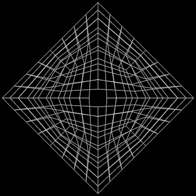
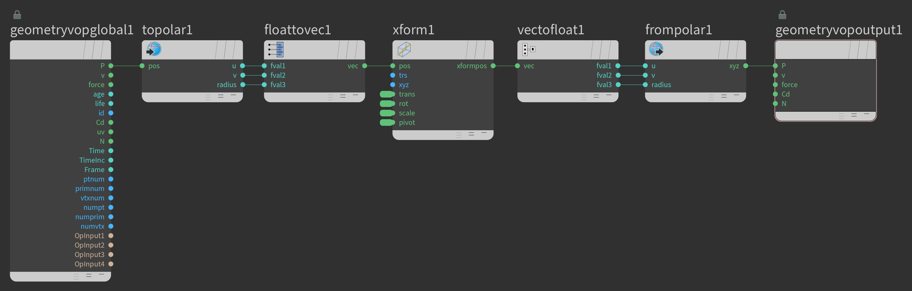

<!------------------------------------------------------------------------------------------------------------------------------------------------->

   
  
  
  

<!------------------------------------------------------------------------------------------------------------------------------------------------->

#  Davidope III
This project is very much inspired by davidope's art: https://www.instagram.com/dvdp/

It's an experiment, what happens when you rotate a position vector after you convert it to polar coordinates? obviously, it doesn't make a lot of sense, but the results are beautiful.

<!------------------------------------------------------------------------------------------------------------------------------------------------->

   I share my personal projects for free with everyone.

 

   You are welcome to explore all of them
   <a href="https://github.com/nitzan-treg/community_projects/">
      here
   </a>

 
